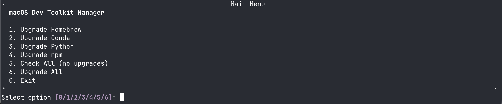

# macOS Dev Toolkit Manager


An interactive Python script that safely manages upgrades for Homebrew, Conda, Python, and npm with logging and rollback capability.

**Script Name:** `safe_update.py` - Emphasizing safe, controlled upgrades for your development environment.

## Preview



*Interactive menu with rich UI showing upgrade options and system status*

## Features

- ✅ **Safe Upgrades**: Automatically applies patch updates, prompts for minor/major versions
- 📸 **Snapshots**: Saves pre-upgrade state to `~/upgrade-logs/` for rollback
- 📝 **Detailed Logging**: Every command and action is logged with timestamps
- 🎨 **Rich UI**: Beautiful tables and panels (uses `rich` library if available)
- 🎯 **Selective Upgrades**: Choose which package manager to upgrade
- 🧹 **Automatic Cleanup**: Cleans up caches after successful upgrades

## Safety Rules

| Upgrade Type | Behavior | Example |
|-------------|----------|---------|
| **Patch** (x.x.Z) | ✅ Auto-upgrade | 3.12.11 → 3.12.12 |
| **Minor** (x.Y.x) | ⚠️ Requires confirmation | npm 10.x → 11.x |
| **Major** (X.x.x) | 🛑 Requires manual review | Python 3.12 → 3.13 |

## Installation

The script uses Python's standard library, but for the best experience, install `rich`:

```bash
pip install rich
```

## Usage

### Run the script

```bash
python safe_update.py
# or
./safe_update.py
```

### Menu Options

1. **Upgrade Homebrew** - Updates Homebrew and safe packages
2. **Upgrade Conda** - Updates Conda package manager
3. **Upgrade Python** - Updates Python via Conda
4. **Upgrade npm** - Updates global npm packages and npm itself
5. **Check All** - Shows current versions without upgrading
6. **Upgrade All** - Runs all upgrades in sequence
0. **Exit** - Quit the program

### What Gets Upgraded

#### Homebrew
- Homebrew formulae and casks
- Safe packages upgraded automatically
- Major/minor version upgrades require confirmation
- Runs `brew cleanup` after upgrades

#### Conda
- Conda package manager itself
- Runs `conda clean --all` after upgrades

#### Python
- **Automatically detects** Python source (Conda, Homebrew, or System)
- **Conda Python**: Upgraded via `conda update python`
- **Homebrew Python**: Upgraded via `brew upgrade python@3`
- **System Python**: Not upgraded (macOS system Python should not be modified)
- **Other sources** (pyenv, asdf, etc.): Not supported
- Major version changes require confirmation
- Displays Python path and source for transparency

#### npm
- Global npm packages first
- npm itself upgraded last (as recommended)
- Runs `npm cache verify` after upgrades

## Logs and Snapshots

All logs and snapshots are saved to `~/upgrade-logs/`:

```
~/upgrade-logs/
├── upgrade_20250605_143022.log     # Detailed execution log
├── snapshot_20250605_143022.json   # Pre-upgrade system state
├── upgrade_20250605_151533.log
└── snapshot_20250605_151533.json
```

### Snapshot Format

```json
{
  "homebrew": {
    "version": "4.2.10",
    "outdated_count": 2,
    "outdated_packages": [...]
  },
  "conda": {
    "current": "25.9.1",
    "latest": "25.9.1"
  },
  "python": {
    "current": "3.12.12",
    "latest": "3.12.12"
  },
  "npm": {
    "current": "11.6.2",
    "latest": "11.6.2",
    "outdated_count": 0,
    "outdated_packages": []
  }
}
```

## Manual Rollback

If you need to rollback to a previous version:

1. Check the snapshot file: `cat ~/upgrade-logs/snapshot_<timestamp>.json`
2. Manually reinstall the previous version:

```bash
# Homebrew
brew install <package>@<version>

# Conda
conda install conda=<version>

# Python
conda install python=<version>

# npm
npm install -g npm@<version>
npm install -g <package>@<version>
```

## Example Session

```
┏━━━━━━━━━━━━━━━━━━━━━━━━━━━━━━━━━━━━━━━━━━━━━┓
┃                   Welcome                   ┃
┗━━━━━━━━━━━━━━━━━━━━━━━━━━━━━━━━━━━━━━━━━━━━━┛

System Upgrade Manager

Log file: ~/upgrade-logs/upgrade_20250605_143022.log
Snapshot: ~/upgrade-logs/snapshot_20250605_143022.json

This tool will help you safely upgrade your system packages.

┏━━━━━━━━━━━━━━━━━━━━━━━━━━━━━━━━━━━━━━━━━━━━━┓
┃                 Main Menu                   ┃
┗━━━━━━━━━━━━━━━━━━━━━━━━━━━━━━━━━━━━━━━━━━━━━┛

System Upgrade Manager

1. Upgrade Homebrew
2. Upgrade Conda
3. Upgrade Python
4. Upgrade npm
5. Check All (no upgrades)
6. Upgrade All
0. Exit

Select option [0/1/2/3/4/5/6]: 5

Checking Homebrew...
✓ All Homebrew packages up to date

Checking Conda...
✓ Conda 25.9.1 (up to date)

Checking Python...
✓ Python 3.12.12 (up to date)

Checking npm...
npm: 11.6.2 → Latest: 11.6.2
✓ All global npm packages up to date

✓ Snapshot saved to: ~/upgrade-logs/snapshot_20250605_143022.json
```

## Tips

- Run **option 5 (Check All)** first to see what needs updating
- Use **option 6 (Upgrade All)** for routine maintenance
- Always review logs in `~/upgrade-logs/` after major upgrades
- Keep snapshots for at least 30 days for rollback capability
- Test your development environment after major upgrades

## Troubleshooting

### "rich library not found"
Install with: `pip install rich`
The script will work without it but with plain text output.

### Script name issues
Make sure you're running `safe_update.py` (not the old `system_upgrade.py` name).

### Conda upgrade conflicts
If Conda dependencies conflict, try:
```bash
conda update -n base -c defaults conda --force-reinstall
```

### Homebrew permission errors
Fix with: `sudo chown -R $(whoami) $(brew --prefix)/*`

### npm permission errors
Fix with: `sudo chown -R $(whoami) $(npm config get prefix)/{lib/node_modules,bin,share}`

## Requirements

- Python 3.7+
- macOS (tested on macOS 15.1+)
- zsh shell
- Homebrew, Conda, and/or npm installed
- Optional: `rich` library for enhanced UI (`pip install -r requirements.txt`)

## Security Features

### Command Injection Prevention
- **Package Name Validation**: All package names validated before use in shell commands
- **Controlled Execution**: Uses shell=True only for pipes/redirects with validated inputs
- **Input Sanitization**: Comprehensive validation using regex patterns

### Safe Defaults
- **System Python Protection**: Never modifies macOS system Python
- **Backup First**: Always creates snapshots before making changes
- **Comprehensive Logging**: All actions logged for audit trail
- **Error Handling**: Graceful failure handling with proper error messages

### Secure Dependencies
- **Pinned Requirements**: `requirements.txt` with version constraints
- **Minimal Dependencies**: Only `rich` library for UI (optional)
- **No Untrusted Input**: All commands are hardcoded or validated

## License

Free to use and modify.
